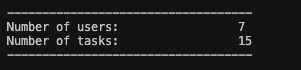
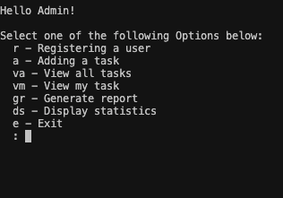
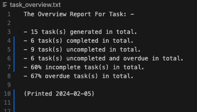
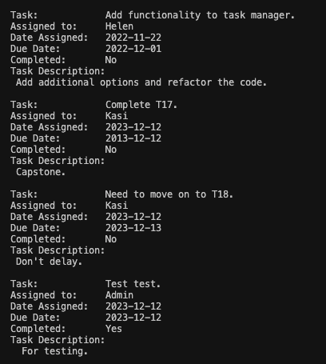

# TeamTaskTracker

## Description

TeamTaskTracker is a simple yet powerful task management system designed for small businesses to efficiently manage tasks assigned to each team member. This program allows users to perform various tasks such as assigning, editing, completing, and adding tasks, as well as adding new users. Additionally, it provides functionality to view tasks, generate display statistics, and easily see all tasks displayed on the screen in a user-friendly manner.

## Table of Contents






## Installation

To install TeamTaskTracker locally, follow these steps:

```bash
# Clone the repository
git clone https://github.com/Kasi-Code/finalCapstone

# Navigate to the project directory
cd finalCapstone
